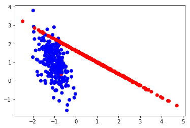
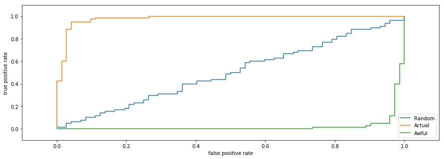

# Бинарная классификация и метрики качества

В этом задании необходимо разобраться, в чем состоит разница между разными метриками качества. Будем рассматривать задачу бинарной классификации (с откликами 0 и 1), но больше сосредоточимся на предсказанных вероятностях того, что объект принадлежит классу 1. Таким образом, мы будем работать с вещественной, а не бинарной целевой переменной.

Чтобы вычислить метрики качества в задаче классификации, впрочем как и для любой задачи обучения с учителем, нужно знать только два вектора: вектор правильных ответов (actual) и вектор предсказанных величин (predicted). В данной задаче мы будем использовать LogisticRegression классификатор.

### Data generation

Для начала сгенерируем данные (dataset) для задачи бинарной классификации. Используйте `make_classification` из пакета `sklearn.datasets` со следующими параметрами:

* n_features = 2,
* n_samples=500,
* n_informative = 2,
* n_classes = 2, 
* n_redundant = 0,
* n_clusters_per_class = 1,
* random_state = 420 - для воспроизведения стабильных результатов

Нарисуйте соответствующий scatter plot. Должно получиться следующее:

Для вычисления каких-либо метрик качества необходимо иметь тестовую выборку. Поэтому разбейте созданный dataset на train и test выборки в соотношении 70%/30%. Используйте `train_test_split` из `sklearn.model_selection` с `random_state = 1`

### LogisticRegression

Обучите `LogisticRegression` на обучающей выборке (`fit`). Важно! Используйте `random_state=42`, а остальные параметры с дефолтными значениями для получения детерминированных результатов (постоянных). 
Теперь предскажите метки для тестовой выбоки (`predict`).

## Metrics

### Precision

Для предсказанных меток вычислите [`precision`](https://en.wikipedia.org/wiki/Precision_and_recall#Definition_&#40;classification_context&#41; ) (точность) метрику. Используйте формулу из wiki.
Округлите результат до 4го знака после запятой - первый ответ.

Сравните свой результат с результатом соответсвующего метода из `sklearn.metrics` (там есть и другие, которые придется использовать позже).

Для вычисления метки `LogisticRegression` использует порог (`threshold`) равным $`0.5`$ ($`[p_i > 0.5]`$, $`p_i`$ - вероятность 1 класса, $`i`$ - индекс объекта выборки). Очевидно, что значение порога влияет на качество предсказания.

Поскольку классификатор не предоставляет возможности изменить порог - вычислите соответсвующие вероятности для класса *1* на тестовой выборке. Используйте метод классификатора - `predict_proba`. Вычислите `precision` для новых меток, полученных путем сравнения соответствующих вероятностей с порогом `threshold = 0.8`. Полученное значение - второй ответ (округление такое же).

### Recall

Посмотрите, как себя ведет метрика полнота (`recall`) от значения `threshold'а`?
Попробуйте нарисовать графики зависимости, где по оси абцисс изменение `threshold'а`, а по оси ординат - `recall` или `precision`. Если не получилось самостоятельно, можно воспользоваться готовой реализацией - `precision_recall_curve` из `sklearn.metrics`.

### Accuracy

Давайте посмотрим на следующую метрику `accuracy`(см. формулу ниже на wiki). Посчитайте ее значение на нескольких `threshold'ах`. Как данная метрика зависит от точности и полноты?

Найдите значение `threshold'а`, при котором значение `accuracy` достигает своего максимума. Для этого можно использовать метод дифференциальной эволюции из пакета `scipy.optimize`. Создайте соответствующую функцию вычисления `accuracy` при заданном пороге. Почему используем метод дифференциальной эволюции? Почему градиентные методы здесь неуместны? Полученное значение с 4мя знаками после запятой - третий ответ.

### ROC AUC

Еще одна полезная метрика - [`roc_auc_score`](https://en.wikipedia.org/wiki/Receiver_operating_characteristic). Попробуем нарисовать данные кривые для нескольких классификаторов - Случайного, Текущего и Текущего, но для предсказания 0 класса (где вероятности равны $`1 - p_i`$ или первый столбец в результирующей матрице `predict_proba`).
Таким образом, в некотором смысле,  получим наилучший классификатор (текущий), средний - (рандомный) и наихудший - ("обратный").

Сгенерируйте значения вероятностей для случайного классификатора - `np.random.random_sample`. Создайте выборку такого же размера как созданная ранее тестовая выборка, а так же для генерации детерменированных значений установите `np.random.seed = 42`.

Постройте график `roc_curve`из `sklearn.metrics` для полученных вероятностей описанных выше классификаторов. У вас должно получится следующее:

Чем больше площадь под кривой - тем лучше качество классификатора. Если вы получаете график для своего классификатора (в какой-то другой своей задаче), который находится ниже прямой проходящей через начало координат и точку (1,1) - то лучше используйте случайный генератор :laughing:

Для каждого набора вероятностей вычислите `roc_auc_score` с 4мя знаками после запятой в порядке убывания - четвертый ответ.

## Cross-validation: evaluating estimator performance

Так же для определения производительности можно использовать кросс-валидацию.
Вычислите `cross_val_score` из `sklearn.model_selection` для логистического классификатора. Поскольку, кросс-валидация разбивает самостоятельно на тестовую и обучающую выборку, то методу необходимо передать все сгенерированные данные.
Вычислите `scoring = 'accuracy' и cv = 10`

Выведите максимум и минимум из полученных оценок с точностью до 2х знаков - последний ответ.

[Отправить задачу](https://goo.gl/forms/yWaIl5Y3CFiSNWBg1)
