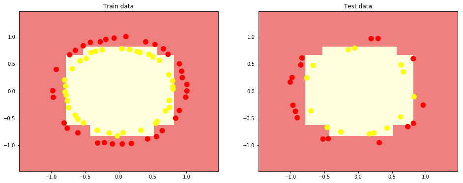
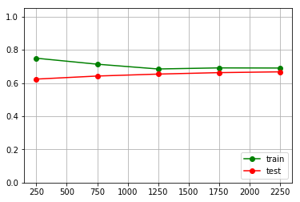

# Decision trees & Random forest

В текущем задании познакомимся со следующими моделями машинного обучения - решающие деревья и случайный лес.
По сравнению с линейными моделями решающие деревья имеют маленькое смещение и большой разброс. Поэтому данная модель довольно сильно подвержена переобучению.

В то же время данная особенность оказывает "положительное влияние" в случае композиции алгоритмов. В основе модели случайный лес лежит именно эта идея, которая позволяет решить проблему переобучения.


## sklearn.tree

docs: http://scikit-learn.org/stable/modules/classes.html#module-sklearn.tree

examples: http://scikit-learn.org/stable/modules/classes.html#module-sklearn.tree

## sklearn.ensemble.RandomForestClassifier

docs:  http://scikit-learn.org/stable/modules/generated/sklearn.ensemble.RandomForestClassifier.html


# Задание 1. Решающие деревья.

1. Сгенерируйте выборку "окружности" используя `datasets.make_circles`. Установите параметры шума `= 0.02` и `random_state=1`
2. Отобразите полученное множество при помощи `matplotlib`. Используйте `scatter` plot.
3. Разбейте сгенерированные данные на обучающую и тестовую подвыборки, используя `train_test_split` из модуля `sklearn.model_selection` в соотношении 70%/30% и `random_state=1`.
4. Обучите `DecisionTreeClassifier(random_state=1)` на соответствующей выборке.
5. Найдите точность предсказания (`accuracy`). Можно использовать метрики из sklearn - `from sklearn import metrics`. Полученное значение округлите до 2 знаков после запятой - первый ответ.


# Задание 2. Решающие деревья.

Нарисуйте "пограничную область", разделяющую классы, для следующих классификаторов (разделяющая поверхность):

1. `DecisionTreeClassifier(random_state = 1, max_depth = 1)`
2. `DecisionTreeClassifier(random_state = 1, max_depth = 3)`
3. `DecisionTreeClassifier(random_state = 1, min_samples_leaf = 3)`
4. `DecisionTreeClassifier(random_state = 1)`

Для этого используйте `pyplot.pcolormesh`.

У вас должно получиться следующее:


На каком классификаторе достигается наилучшее качество на тестовой выборке?
Выведите через пробел номер классификатора, train accuracy, test accuracy так же с точностью до 2 знака - второй ответ.


# Задание 3. Случайный лес.

По данным характеристикам молекулы требуется определить, будет ли дан биологический ответ (`Activity`). Признаки нормализаваны.

Загрузите данные `bioresponse.csv` и просмотрите их (`pandas`). Сбалансированы ли классы? Выведите соотношение классов с точностью до 2 знака - третий ответ.

Создайте классификатор `RandomForestClassifier(n_estimators = 50, max_depth = 5, random_state = 1)`

Используя `learning_curve` из модуля `sklearn.model_selection`, посчитайте точность алгоритма (`scoring='accuracy'`) на разных обучающих подвыборках (установите `train_sizes=np.arange(0.1, 1., 0.2)`) с кросс-валидацией на 3х folds (`cv=3`).

Посчитайте среднюю точность на каждом разбиении как для обучающей так и для тествой подвыборок. Нарисуйте график этих средних значений.

```
pylab.grid(True)
pylab.plot(train_sizes, train_scores_means, 'g-', marker='o', label='train')
pylab.plot(train_sizes, test_scores_means, 'r-', marker='o', label='test')
pylab.ylim((0.0, 1.05))
pylab.legend(loc='lower right')

```


Обучите теперь такой же классификатор (`RandomForestClassifier`), но с глубиной деревьев = 10 (`max_depth = 10`). Нарисуте график "средних точностей".

Повлияла ли глубина деревьев на качество классификатора? Выведите средние значения точности при обучении на выборке размером 2250. Сначала для обучающей выборки, а затем для тестовой с точностью до 4х знаков - четвертый ответ.


[Отправить задачу](https://goo.gl/forms/sdoDmcIY93Wudlsw1)