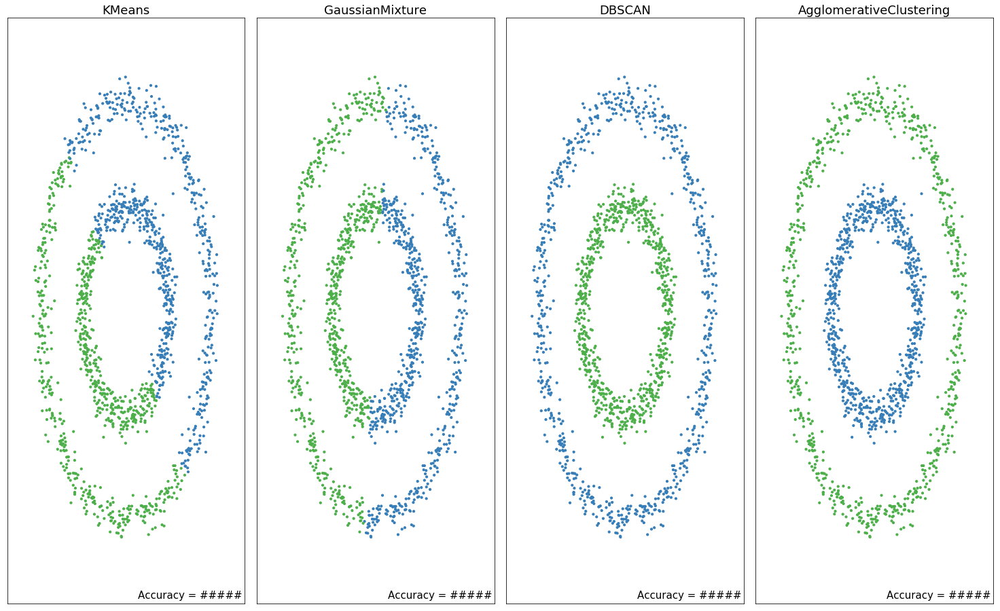

# Кластеризация


## Сравнение методов кластеризации

Для сравнения алгоритмов кластеризации построим несколько различных datasets со следующими параметрами:

1. Окружности: `datasets.make_circles(n_samples=n_samples, factor=.5, noise=.05)`
2. "Полумесяцы": `datasets.make_moons(n_samples=n_samples, noise=.05)`
3. Blobs: `datasets.make_blobs(n_samples=n_samples, random_state=8)`
4. Varied blobs: `datasets.make_blobs(n_samples=n_samples, cluster_std=[1.0, 2.5, 0.5], random_state=170)`
5. Шум - беструктурный пример: `np.random.rand(n_samples, 2)`

где `n_samples = 1500`


Для каждого dataset'а настройте следующие алгоритмы:

1. [KMeans](http://scikit-learn.org/stable/modules/clustering.html#k-means)
2. [GaussianMixture](http://scikit-learn.org/stable/modules/mixture.html#mixture) `covariance_type='full'` - EM алгоритм
3. [DBSCAN](http://scikit-learn.org/stable/modules/clustering.html#dbscan) `eps=0.3`, для Varied blobs `eps = 0.18`
4. [AgglomerativeClustering](http://scikit-learn.org/stable/modules/clustering.html#hierarchical-clustering) `linkage="average", affinity="cityblock", connectivity=con`:

```
from sklearn.neighbors import kneighbors_graph

con = kneighbors_graph(X, n_neighbors=n_neighbors, include_self=False)
con = 0.5 * (con + con.T)
```

и постройте scatter графики для `algorithm.predict(X)`, где `algorithm - ` один из четырех моделей, а цвет соответствует реальной метке - вторая компонента в сгенерированных datasets (первая - координаты точки). Например:

```
plt.scatter(X[:, 0], X[:, 1], s=10, c=y_predicted, cmap=ListedColormap(['#377eb8', '#ff7f00', '#4daf4a']))
```

Перед обучением центрируйте данные:

```
from sklearn.preprocessing import StandardScaler

X = StandardScaler().fit_transform(X) # вычитает среднее и делит на дисперсию
```

Результат для окружностей:




Для каждого dataset'a выведите наибольшее и наименьшее значения точности (`metrics.accuracy_score`), достигаемые на рассмотренных алгоритмах, за исключением ... какого? Обратите внимание, поскольку алгоримы кластеризации не используют метки по определению, то полученные предсказания могут иметь метки "в другом порядке":

```
[0 0 2 ..., 0 2 1]
       -->
[0 0 1 ..., 0 1 2]

0 -> 0
2 -> 1
1 -> 2
```

, для точного вычисления сделайте ремаппинг:

```
mapping = {2 : 1, 1: 2, 0: 0}
mapped_preds = [mapping[pred] for pred in preds]
```

Какой алгоритм справился лучше всего?
Верно ли, что все рассмотреные алгоритмы успешно справляются `Blobs` dataset? Попробуйте изменить `random_state = 70`.


[Отправить задачу](https://goo.gl/forms/0SD2j1oVCq0pkMki2)
